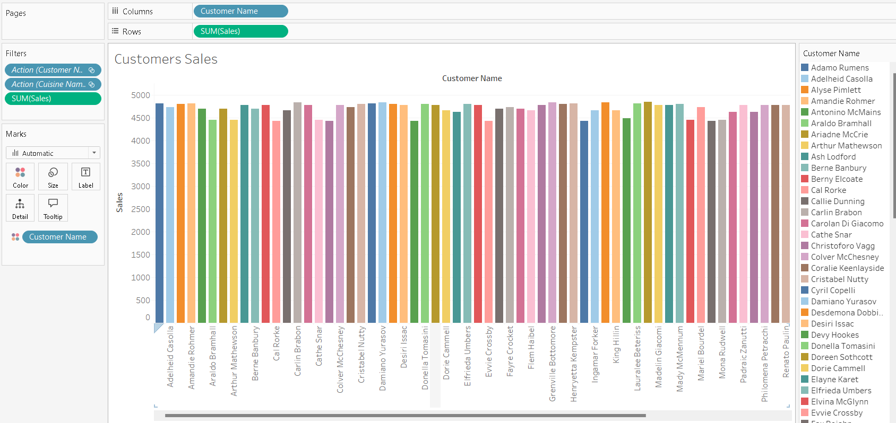

# Little Lemon Restaurant Management System

- [Little Lemon Restaurant Management System](#little-lemon-restaurant-management-system)
  - [Project Description](#project-description)
  - [Entity-Relationship Diagram](#entity-relationship-diagram)
  - [Installation and Setup](#installation-and-setup)
  - [Stored Procedures](#stored-procedures)
    - [GetMaxQuantity()](#getmaxquantity)
    - [CheckBooking()](#checkbooking)
    - [UpdateBooking()](#updatebooking)
    - [AddBooking()](#addbooking)
    - [CancelBooking()](#cancelbooking)
    - [AddValidBooking()](#addvalidbooking)
    - [CancelOrder()](#cancelorder)
  - [Data Analysis with Tableau](#data-analysis-with-tableau)
    - [Customers sales](#customers-sales)
    - [Profit chart](#profit-chart)
    - [Sales Bubble Chart](#sales-bubble-chart)
    - [Cuisine Sales and Profits](#cuisine-sales-and-profits)
    - [Dashboard](#dashboard)

## Project Description

This project is designed to manage the operations of the Little Lemon fast-food restaurant and is a part of the **Meta Database Engineer Certificate** course on Coursera. The project uses MySQL for database modeling and Tableau for data analysis. The `Preparation` folder contains all the initial files and tasks used to start working on this project.

## Entity-Relationship Diagram

To view the Entity-Relationship Diagram, click here or see the image below.


## Installation and Setup

To set up the database, do the following:

1. **Install MySQL**: Download and install MySQL on your machine if you haven't done so.

2. **Populate the data using sql**:insert data using insert to clause.

Your database should now be set up and populated with tables and stored procedures.

## Stored Procedures

### GetMaxQuantity()
This stored procedure retrieves the maximum quantity of a specific item that has been ordered. It's useful for inventory management.

```sql
CREATE PROCEDURE `GetMaxQuantity`()
BEGIN
	SELECT MAX(Quantity)  FROM orders;
END
```

```sql
CALL GetMaxQuantity()
```

### CheckBooking()

The CheckBooking stored procedure validates whether a table is already booked on a specified date. It will output a status message indicating whether the table is available or already booked.

```sql
CREATE PROCEDURE `CheckBooking`(book_date DATE, table_num INT)
BEGIN
DECLARE table_booked INT DEFAULT 0;
SELECT 
    COUNT(table_booked)
INTO table_booked FROM
    bookings
WHERE
    BookingDate = book_date
        AND TableNumber = table_num;
    IF table_booked > 0 THEN
      SELECT CONCAT( "Table ",table_num, " is already booked on",   book_date,".") AS "Booking status";
      ELSE 
      SELECT CONCAT( "Table ",table_num," is not booked on",  book_date,".") AS "Booking status";
    END IF;
END
```sql
CALL CheckBooking('2022-11-12', 3);
```
### UpdateBooking()
This stored procedure updates the booking details in the database. It takes the booking ID and new booking date as parameters, making sure the changes are reflected in the system.

```sql
CREATE PROCEDURE `UpdateBooking`(
    IN booking_id_to_update INT, 
    IN new_booking_date DATE)
BEGIN
    UPDATE `Bookings`
    SET `Date` = new_booking_date
    WHERE `BookinID` = booking_id_to_update;

    SELECT CONCAT('Booking ', booking_id_to_update, ' updated') AS 'Confirmation';
END;
```
```sql
CALL `LittleLemonDB`.`UpdateBooking`(9, '2022-11-15');
```

### AddBooking() 
This procedure adds a new booking to the system. It accepts multiple parameters like booking ID, customer ID, booking date, and table number to complete the process.

```sql
CREATE PROCEDURE `AddBooking`(
    IN new_booking_id INT, 
    IN new_customer_id INT, 
    IN new_booking_date DATE, 
    IN new_table_number INT, 
    IN new_staff_id INT)
BEGIN
    INSERT INTO `LittleLemonDB`.`Bookings`(
        `BookinID`, 
        `CustomerID`, 
        `BookingDate`, 
        `TableNumber`, 
        `StaffID`)
    VALUES(
        new_booking_id, 
        new_customer_id, 
        new_booking_date, 
        new_table_number,
        new_staff_id
    );

    SELECT 'New booking added' AS 'Confirmation';
END;
```
```sql
CALL `LittleLemonDB`.`AddBooking`(17, 1, '2022-10-10', 5, 2);
```

### CancelBooking()
This stored procedure deletes a specific booking from the database, allowing for better management and freeing up resources.
```sql
CREATE PROCEDURE `CancelBooking`(IN booking_id_to_cancel INT)
BEGIN
    DELETE FROM `little-lemon`.`Bookings`
    WHERE `BookinID` = booking_id_to_cancel;

    SELECT CONCAT('Booking ', booking_id_to_cancel, ' cancelled') AS 'Confirmation';
END;
```
```sql
CALL `LittleLemonDB`.`CancelBooking`(9);
```
### AddValidBooking()
The AddValidBooking stored procedure aims to securely add a new table booking record. It starts a transaction and attempts to insert a new booking record, checking the table's availability.

```sql
CREATE PROCEDURE `AddValidBooking`(TableNumber INT, StaffID INT, BookingDate DATE, CustomerID CHAR(11))
BEGIN
START TRANSACTION;
	SELECT 1 AS 'status'
	FROM bookings 
	WHERE BookingDate = BookingDate
	AND TableNumber = TableNumber
	LIMIT 1
	INTO @booking_status;

IF @booking_status = 1 THEN
	ROLLBACK;
	SELECT CONCAT("A client has already booked table ", TableNumber, " on ", BookingDate,  ". Cannot add booking. Transaction cancelled.") AS 'Booking status';

ELSE
	INSERT INTO bookings (table_no, booking_staff_id, booking_date, booking_customer_id) VALUES 
	(TableNumber, StaffID, BookingID, CustomerID);
COMMIT;

SELECT CONCAT("Table ", table_number, " is free - booking successful.") AS 'Booking status';
END IF;
END
```
```sql
CALL AddValidBooking('2022-10-10', 5, 1, 1);
```


### CancelOrder()
The CancelOrder stored procedure cancels or removes a specific order by its Order ID. It executes a DELETE statement to remove the order record from the Orders table.

```sql
CREATE PROCEDURE `CancelOrder`(IN CancelOrder1 CHAR(11))
BEGIN
	DELETE FROM orders WHERE orderID = CancelOrder1;	
	SELECT 
    CONCAT('Order number ',
            CancelOrder1,
            ' has been cancelled.') AS Confirmation;    
END
```
```sql
CALL CancelOrder(5);
```

## Data Analysis with Tableau
A Tableau workbook has been created, containing various charts and dashboards to facilitate data analysis.

### Customers sales


### Profit chart


### Sales Bubble Chart


###  Cuisine Sales and Profits


### Dashboard


